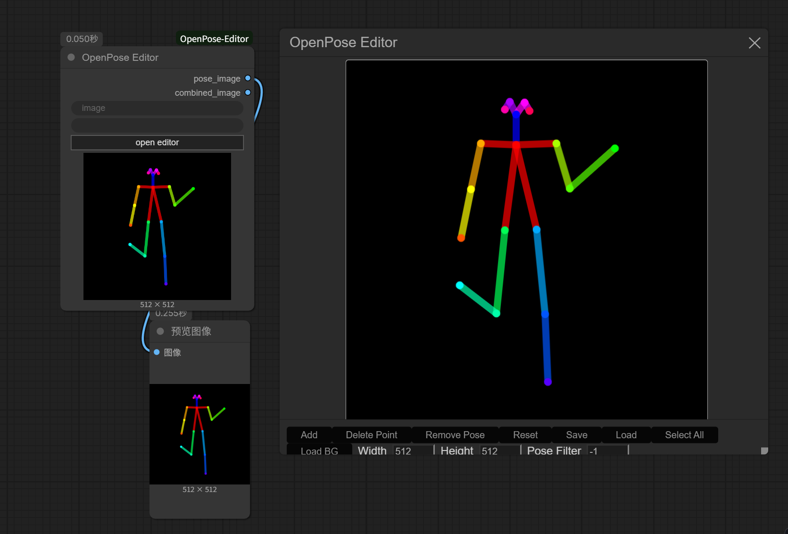
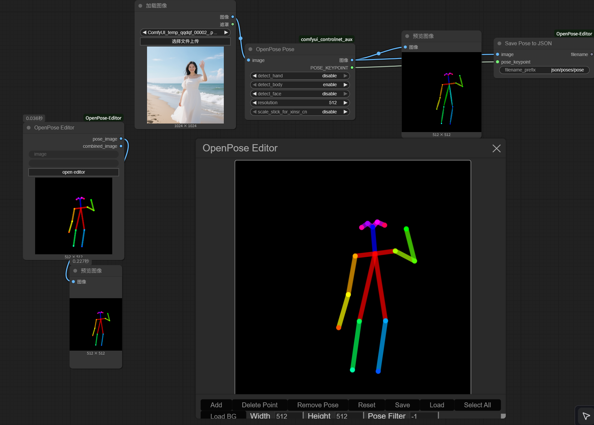
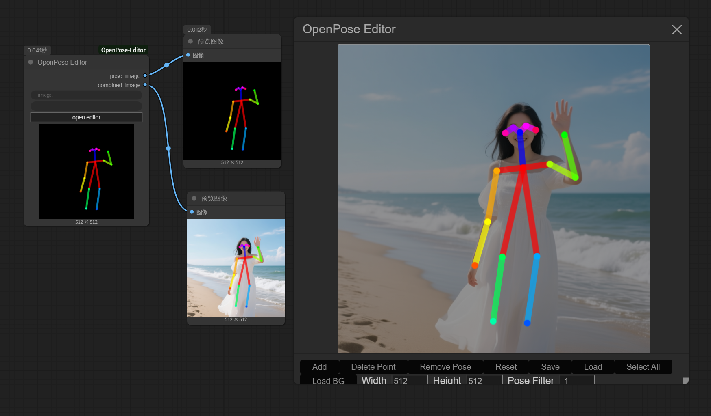

# OpenPose Editor for ComfyUI

## update2025.10.11

Fixed the node to make it compatible with the latest version of ComfyUI; added a new node for saving poses from the "openpose pose" node, along with pose loading functionality.

A port of the [openpose-editor](https://github.com/fkunn1326/openpose-editor) extension for stable-diffusion-webui, now compatible with [ComfyUI](https://github.com/comfyanonymous/ComfyUI)

## Usage

Added the "openpose edit" node.

Click "open edit" to open the canvas for editing.

Use the "load" button to load a pose (the pose data should be saved using the "save pose to json" node, which captures the KEY_POINT output from the "openpose pose" node).

Use the "load_BG" button to load a background image.

"pose_image" outputs the image containing only the pose; "combined_image" outputs the image with the pose overlaid on the background.

Use the "pose filter" to filter poses, allowing you to edit a specific pose without interference from others. The default value is -1, which enables editing of all poses. Values greater than or equal to 0 will enable poses sequentially based on the selected index.

## Notice

Thanks for the original node [ComfyUI-OpenPose-Editor](https://github.com/space-nuko/ComfyUI-OpenPose-Editor) and [WilliamPatin](https://github.com/WilliamPatin).I used Gemini 2.5 Pro to modify this node. Please forgive the crude fix and the remaining bugs, as I lack coding expertise. Anyone is welcome to make further improvements!
